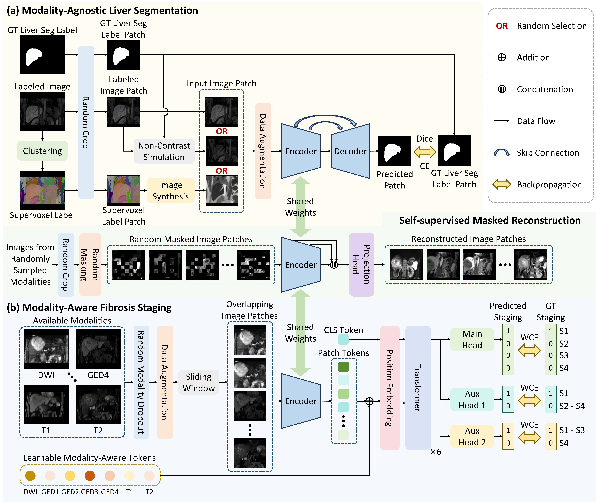

# MA2: Unifying Modality-Agnostic Segmentation and Modality-Aware Staging for Real-World Liver Fibrosis Analysis

This repository officially hosts the algorithm submitted by the CitiSJTU team to the CARE-Liver track of the CARE 2025 challenge (https://zmic.org.cn/care_2025/track4/).

Our algorithm won the Best Performance Award of CARE-Liver Segmentation (Non-contrast).


## Algorithm framework

Accurate liver segmentation and fibrosis staging play a pivotal role in Artificial Intelligence (AI)-assisted surgical decision-making, facilitating precise disease management, prognostic evaluation, and clinical interventions. However, existing approaches face significant limitations when applied to real-world clinical data: (1) Liver segmentation is hindered by the scarcity of annotated data, particularly for non-contrast sequences; (2) Multi-modality fibrosis staging encounters obstacles due to random modality absence and inter-sequence misalignment. To tackle these challenges, we propose MA2, a unified framework integrating two key components: *m*odality-*a*gnostic segmentation and *m*odality-*a*ware staging. For modality-agnostic liver segmentation, we develop a training pipeline that utilizes pseudo-images synthesized from supervoxels and simulated non-contrast images to enhance model generalization capability. For liver fibrosis staging, we introduce learnable modality-aware tokens that augment image patch tokens from available modalities, coupled with random modality dropout during training to enhance cross-modality information integration. Experiments on the CARE-Liver track dataset from the CARE 2025 challenge demonstrate the superior performance of our method in both validation and testing phases.




## Feedback and Contact

- Email: 1820037839@sjtu.edu.cn


## Get Started

### Requirements
- `Python 3`
- `torch==2.1.2`
- `torchvision==0.16.2`
- `monai==1.4.0`
- `opencv-python==4.11.0.86`
- `elasticdeform`
- `numpy==1.26.4`
- `einops==0.8.1`
- `tqdm`
- `scikit-learn==1.6.1`

### Install
```
conda create -n MA2 python=3.10.16
conda activate MA2
pip install -r requirements.txt
git clone https://github.com/Kendra9999/MA2.git
```

### Pretrained models
Our method uses the pretrained model of [Anatomix](https://github.com/neel-dey/anatomix/). Please download the pretrained model `anatomix.pth` and place it in the `anatomix-main/model-weights/` directory.

### Data preparation

1. LiQA data
Please follow the instructions in the [CARE-Liver track](https://zmic.org.cn/care_2025/track4/) to download the LiQA dataset and place it in the `Data/CARE-Liver/` directory.

2. CHAOS-MRI data
Download the CHAOS-MRI dataset from the [CHAOS challenge](https://chaos.grand-challenge.org/) and place it in the `Data/CHAOS_MRI/` directory.

Please run the following command to convert the DICOM images to NIfTI format:
```
python Data_preprocess/CHAOS_MRI/dcm_png_to_nii.py
```

3. Supervoxel generation
For supervoxel generation, please follow the instructions in https://github.com/sha168/ADNet to compile the supervoxel generation tool. 

After compiling the supervoxel generation tool, please run the following command to generate supervoxels for the LiQA data and the CHAOS-MRI dataset:
```
cd supervoxel
python generate_supervoxels_liqa.py
python generate_supervoxels_chaos.py
```

The generated supervoxels for the LiQA data and the CHAOS-MRI dataset are placed in the `Data_preprocess/` directory.


### Training
Please run the following command to train the model:
```
cd MA2
python train.py
```

### Evaluation
Please run the following command to evaluate the model:
```
cd MA2

# LiFS-Contrast
python test_LiFS.py \
  --checkpoint_path /path/to/best_cls_dict.pth \
  --test_data_dir ../Data/CARE-Liver/LiQA_val/Data \
  --setting Contrast \
  --output_dir ../val_result

# LiFS-NonContrast
python test_LiFS.py \
  --checkpoint_path /path/to/best_cls_dict.pth \
  --test_data_dir ../Data/CARE-Liver/LiQA_val/Data \
  --setting NonContrast \
  --output_dir ../val_result

# LiSeg-NonContrast
python test_LiSeg.py \
  --checkpoint_path /path/to/best_dict.pth \
  --test_data_dir ../Data/CARE-Liver/LiQA_val/Data \
  --test_modalities DWI_800 T2 T1 \
  --output_dir ../val_result

```

## Submission docker
Please download our submission docker file from [Baidu Netdisk](https://pan.baidu.com/s/1LnFqrO72qK920l5uAtY2iw?pwd=6ez5).

1. load the docker image
```
docker load -i lifs-contrast-citisjtu.tar.gz
docker load -i lifs-noncontrast-citisjtu.tar.gz
docker load -i liseg-noncontrast-citisjtu.tar.gz
```

2. run the docker container
```
docker run --rm --gpus all -v /path/to/test_data/:/input:ro -v /path/to/test_output:/output -it lifs-contrast-citisjtu
docker run --rm --gpus all -v /path/to/test_data/:/input:ro -v /path/to/test_output:/output -it lifs-noncontrast-citisjtu
docker run --rm --gpus all -v /path/to/test_data/:/input:ro -v /path/to/test_output:/output -it liseg-noncontrast-citisjtu
```

## 🛡️ License

This project is under the MIT license. See [LICENSE](LICENSE) for details.

## 🙏 Acknowledgement

- Some codes are modified from [Anatomix](https://github.com/neel-dey/anatomix/), [ViT](https://github.com/lucidrains/vit-pytorch/), [AD-Net](https://github.com/sha168/ADNet), [SSL-ALPNet](https://github.com/cheng-01037/Self-supervised-Fewshot-Medical-Image-Segmentation).

## 📝 Citation

If you find this repository useful, please consider citing this paper.
